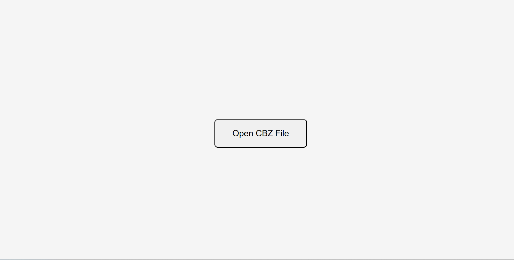
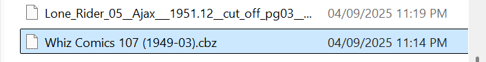
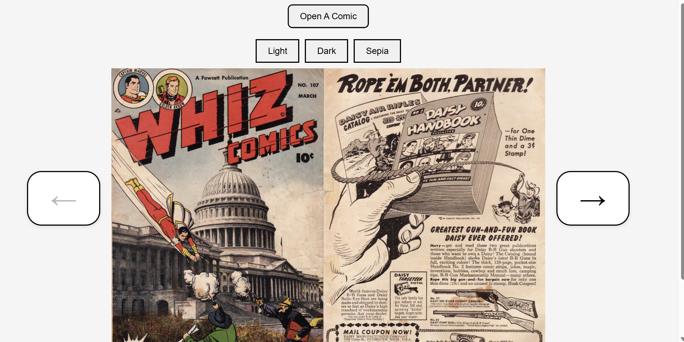

# comic-book-reader
This is a Comic book reader built in React that will display CBZ (comic book zip) files in a 2 page format

**Live Demo:** [View on Vercel](https://comic-book-reader-alpha.vercel.app/)


### Manual Installation

1) Clone the repository:

```sh
git clone https://github.com/MSA2502/comic-book-reader.git
   ```

2) Navigate to the React project folder:

```sh
cd comic-book-reader/comic-reader
```

3) Install dependencies:    

```sh
npm install
```
    
4) Start the development server:

```sh
npm start
```

5) Open the app in your browser:
```sh
http://localhost:3000
```

# Instructions
1) Click "Open CBZ file":



2) Select a CBZ file


3) Read The Comic

 

# Where to find CBZ files?

Public Domain CBZ files can be found and downloaded on Comic Book Plus, and Digital Comics Museum. They have been linked below:

[Comic Book Plus](https://comicbookplus.com/)

[Digital Comics Museum](https://digitalcomicmuseum.com/#:~:text=We%20are%20the%20best%20site,warrant%20extra%20attention%20from%20fandom.)


# Dependencies

React

JSZip (for reading CBZ/ZIP files)


